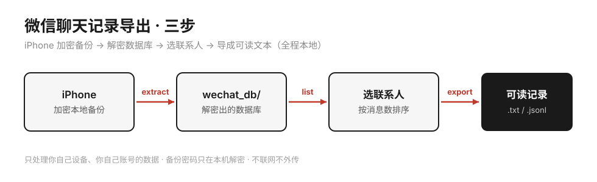
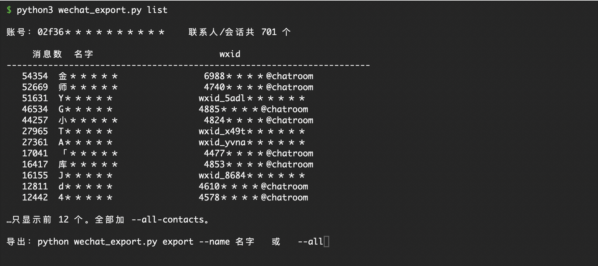

<h1 align="center">wechat-export-tool</h1>

<p align="center">
从 iPhone 加密备份里，把 <b>你自己的</b> 微信聊天记录导出成可读文本 —— 全程在你自己电脑上跑，数据不出本机。
</p>

<p align="center">
  
</p>

> ⚠️ **动手前先读 [DISCLAIMER.md](DISCLAIMER.md)。** 一句话：**只导你自己的号、你自己设备上的数据**；导出来是明文隐私，自己收好，别上传到任何网站。

---

## 这是什么

微信从来不给你一份完整的聊天备份 —— 换手机可能丢，误删找不回，哪天号出问题就全没了。

这个工具走 **iPhone 加密备份** 这条路（不碰微信本体、不改任何系统安全设置），把你和某个人的完整聊天记录导出成：

- **`名字.txt`** —— 一行一条，`[时间] 谁说的：内容`，人能直接读。
- **`名字.jsonl`** —— 一行一条结构化记录，方便再喂给别的程序 / AI。

图片、语音、视频、链接会标成 `[图片]` `[语音]` `[链接] 标题 网址` 这样的占位（MVP 先不导出媒体文件本体，见[路线图](#路线图)）。

**只支持 iPhone。** 安卓 / Windows 微信用户，直接用成熟的 [WeChatMsg（留痕）](https://github.com/LC044/WeChatMsg)，别在这重复造轮子。

## 环境要求

- 一台 **Mac**（Windows 也能跑，备份路径见 FAQ）
- **Python 3.9+**
- 你的 **iPhone** + 数据线
- 你和对方的聊天记录还在手机上（往上滑能翻到很久以前）

## 安装

```bash
git clone https://github.com/Hype-yolo/wechat-export-tool.git
cd wechat-export-tool
pip install -r requirements.txt
```

---

## 用法（三步）

### 第 0 步（前提）：给 iPhone 做一次加密备份

<!-- 截图待补：把「访达 → iPhone → 通用 → 勾上『加密本地备份』」那一屏保存为 docs/backup.png，再取消下面这行注释
<p align="center"></p>
-->

1. 数据线把 iPhone 插到电脑，打开 **访达（Finder）**，左侧点你的 iPhone（第一次要在手机上点「信任」）。
2. 在「通用」页选 **「将 iPhone 上的所有数据备份到这台 Mac」**。
3. **勾上「加密本地备份」**，设一个密码，**记死它**（后面解密要用，忘了就白做；以前设过就用旧密码）。
4. 点 **「立即备份」**，等它跑完。整机备份又慢又占地方，可能几十分钟到两三小时。

> 💡 备份中途别让手机锁屏、别拔线。把「设置 → 显示与亮度 → 自动锁定」临时改成「永不」最稳。

### 第 1 步：解密出微信数据库

```bash
python wechat_export.py extract --password 你的备份加密密码
```

预期输出：

```
● 备份目录：/Users/you/Library/.../Backup/00008xxx
● 用密码解锁备份（密钥全程只在本机内存里）…
✓ 密码正确，备份已解锁
● 备份里有微信文件 4128 个，正在导出数据库到 wechat_db …
✓ 完成：12 个数据库已解密到 wechat_db
下一步：python wechat_export.py list
```

### 第 2 步：看看有哪些联系人，挑出你要导的

```bash
python wechat_export.py list
```

<p align="center"></p>

```
账号：a1b2c3...    联系人/会话共 683 个

    消息数  名字                      wxid
----------------------------------------------------------------------
    6791  张三                      wxid_xxxxxxxx
    3436  李四                      wxid_yyyyyyyy
     512  某某群                     123456@chatroom
...只显示前 40 个。全部加 --all-contacts。
```

### 第 3 步：导出

```bash
python wechat_export.py export --name 张三        # 按备注/昵称导某个人
python wechat_export.py export --wxid wxid_xxx     # 按 wxid 精确导
python wechat_export.py export --all               # 导出所有人（跳过消息很少的）
```

预期输出：

```
✓ 张三：6791 条  →  张三.txt / 张三.jsonl
```

导出的文件在 `out/` 目录里。

---

## 导出长啥样

`out/张三.txt`：

```
# 和 张三（wxid_xxxxxxxx）的聊天记录  共 6791 条

[2023-09-01 20:31] 我：在吗
[2023-09-01 20:32] 张三：在的，怎么了
[2023-09-01 20:32] 张三：[图片]
[2023-09-05 12:10] 我：[链接] 这篇你看看 https://mp.weixin.qq.com/s/xxxx
```

`out/张三.jsonl`（每行一条，方便程序读）：

```json
{"time": 1693571460, "date": "2023-09-01 20:31", "sender": "me", "name": "我", "type": 1, "text": "在吗"}
{"time": 1693571520, "date": "2023-09-01 20:32", "sender": "other", "name": "张三", "type": 1, "text": "在的，怎么了"}
```

---

## 常见问题

**Q：一定要「加密」备份吗？** 是。这个工具用的解密库只认加密备份，不加密的备份读不出微信数据。

**Q：忘了备份密码怎么办？** 没有找回。在 iPhone 上「设置 → 通用 → 传输或还原 iPhone → 重置 → 重置所有设置」会清掉备份加密密码，之后重新做一次加密备份、设个你记得住的新密码。

**Q：提示检测到多个微信号？** 一台手机登过几个号就会有几套数据。用 `--account 目录名的一部分` 指定；不指定默认选消息最多的那个。

**Q：Windows 能用吗？** 能，但 iPhone 备份路径不一样，一般在
`C:\Users\你\Apple\MobileSync\Backup\`（旧版在 `...\AppData\Roaming\Apple Computer\MobileSync\Backup\`）。用 `--backup-dir "路径"` 指定即可。

**Q：导出的名字是乱码 wxid？** 说明这个联系人在通讯录里没备注也没昵称记录，属正常，用 `--wxid` 照样能导。

**Q：有些消息导成了 `[未解码的长消息]`？** 新版微信会把极少数超长文本消息用 zstd 压缩后存库，而且用的是内嵌在微信客户端里的私有字典。这个字典没有一起进备份，用任何标准 zstd 库都解不开（会报 dictionary mismatch）。所以这类消息目前只能导成占位，不会吐二进制乱码，也不影响其余消息。实测占比约 3%，且只落在超长消息上。

## 路线图

- [ ] 导出图片 / 语音 / 视频文件本体，生成图文内嵌的 HTML 聊天记录
- [ ] 语音消息（`.aud`，SILK 编码）本地转文字塞回时间线
- [ ] 群聊成员名字还原
- [ ] 还原 `[未解码的长消息]`（需要微信私有 zstd 字典）

## 隐私

全程本地：备份在你电脑、解密在你电脑、导出文件在你电脑。备份密码只在内存里用于解密，**不写盘、不联网、不上传**。本仓库不含任何真实聊天数据，`.gitignore` 已挡掉 `wechat_db/`、`out/`、`*.sqlite`、`*.jsonl`。

## 致谢

- [iphone_backup_decrypt](https://github.com/jsharkey13/iphone_backup_decrypt) —— 解密 iPhone 加密备份的核心库
- [WeChatMsg（留痕）](https://github.com/LC044/WeChatMsg) —— Windows / 安卓路线的成熟方案

## License

[MIT](LICENSE)
